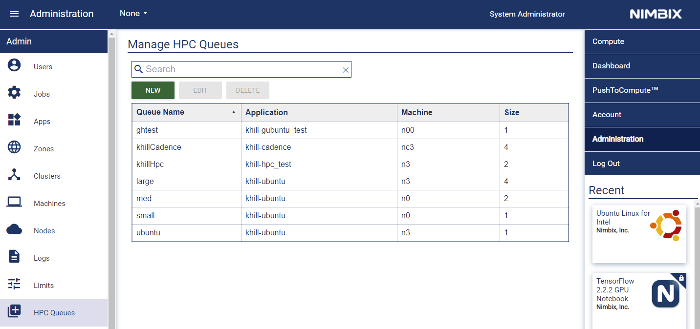

# JARVICE HPC Client Interface (JARVICE-HPC)

JARVICE-HPC provides a method to submit and control jobs on the [JARVICE](https://www.nimbix.net/platform) platform with traditional HPC client-side scripts via the [JARVICE API](https://jarvice.readthedocs.io/en/latest/api/).

* [Overview and Use Cases](#overview-and-use-cases)
* [Architecture](#architecture)
* [Additional Features](#additional-features)
* [Client-side Configuration](#client-side-configuration)
* [JARVICE XE Configuration](#jarvice-xe-configuration)
* [Supported Application Patterns](#supported-application-patterns)
* [License](#license)

---

## Overview and Use Cases

JARVICE-HPC provides client-side scripts with compatible interfaces to submit and manage jobs on any private, hybrid, or public cloud deployment of JARVICE XE.  Submission and job control logic can be reused unmodified when migrating to cloud-native HPC powered by JARVICE.  The client-side tools use a "plugin" architecture that can translate commands to the native JARVICE API endpoints.  Currently supported plugins are:
* Slurm
* Sun Grid Engine (SGE)

The client-side tools are extensible and new plugins can be easily extended to support other scheduler client types.

JARVICE supports defining queues to allow job submission to specific application containers, and manages resource limits, multi-tenancy, and cluster placement using all existing interfaces and mechanisms (e.g. job limits, app restrictions, identity management, etc.).  The JARVICE-HPC interface can be used to submit scripts rather than standard JARVICE application JSON, increasing compatibility with existing tooling for sites migrating to cloud-based HPC.

### Use Cases

* Migrating from traditional HPC clusters to multi/hybrid cloud HPC, while maintaining compatibility with existing workflow scripts and applications.
* "Cloud bursting" from legacy HPC environments with minimal modifications to existing submission scripts.  JARVICE-HPC clients can coexist on the same submission nodes used for the eixsting environment, and can be selected by controlling a user's `${PATH}` environment variable.
* Enabling legacy engineering/research software hardcoded to interface directly with a job scheduler for multi/hybrid cloud use.

---

## Architecture


### Architectural Notes

* The JARVICE API service for a given deployment accepts job submission in either traditional HPC script format or cloud-native HPC JARVICE application format.  All jobs are submitted via the API's `/jarvice/submit` endpoint.
* The JARVICE-HPC client plugins provide front-end compatibility to submit traditional HPC-style scripts in various forms.
* JARVICE normalizes job submission regardless of method - all jobs become JARVICE jobs on the system.
* The JARVICE-HPC client plugins can manage JARVICE jobs using traditional HPC client techniques (e.g. inspect job status, terminate jobs, etc.)
* The deployment's Business Logic Service (DAL) enforces authentication, authorization, policies, limits, identify, and other system-wide or self-service team restrictions regardless of job submission method.
* The Upstream Scheduler Service submits compute control to one or more Downstream Clusters to seamlessly facilitate multi/hybrid cloud topologies; this is generally opaque to the client side and is governed by system administrative policies.

---

## Additional Features

* Dynamic and "best fit" resource selection, within configured limits for users/teams.
* Dynamic discovery of available queues from clients.
* Unified view and management of jobs submitted with JARVICE-HPC using regular JARVICE administrative tooling (including reports).
* Multi-cluster/multi-zone support with minimal client-side configuration.
* Integration with license-based queuing by requesting features along with job submission - integrates with site-specific deployments of [JARVICE License Manager](https://github.com/nimbix/jarvice-helm/blob/master/LicenseManager.md)

---

## Client-side Configuration

### Prerequisites

#### Supported platform

JARVICE-HPC targets the Linux OS and has currently been tested with:

* Ubuntu Bionic
* CentOS 8

#### Building requirements

JARVICE-HPC is built using GoLang 1.14 Docker container

* Install Docker: https://docs.docker.com/engine/install/

### Install

#### SGE

```
git clone https://github.com/nimbix/jarvice-hpc
cd jarvice-hpc
./install.sh sge
```

#### Slurm

```
git clone https://github.com/nimbix/jarvice-hpc
cd jarvice-hpc
./install.sh slurm
```

#### RPM Packages (v0.0.3+)

```
rpm -i https://github.com/nimbix/jarvice-hpc/releases/download/<version>/jarvice-hpc-<client>-<version>.x86_64.rpm
```

Example:

```
rpm -i https://github.com/nimbix/jarvice-hpc/releases/download/v0.0.3/jarvice-hpc-sge-0.0.3.x86_64.rpm
```

Package uses `/usr/local` as default installation path. Override using `--prefix` flag:

```
rpm -i --prefix /opt/jarvice https://github.com/nimbix/jarvice-hpc/releases/download/v0.0.3/jarvice-hpc-sge-0.0.3.x86_64.rpm
```

Alternatively, RPMs can be directly downloaded from the [releases page](https://github.com/nimbix/jarvice-hpc/releases)

### Running SGE jobs

#### Configure JARVICE credentials

The user credentials to use with the JARVICE API need to be configured before submitting work with a JARVICE-HPC plugin. The following command will write a configuration file to: ${HOME}/.config/jarvice-hpc

```
jarvice login 

Usage:
  jarvice login [login-OPTIONS] Endpoint cluster username  Apikey

Configuration Options:
  -h, --help           Show this help message

[login command options]
      -v, --vault=     JARVICE vault

[login command arguments]
  Endpoint:            JARVICE API endpoint
  cluster:             JARVICE cluster   (e.g. default)
  username :           JARVICE username
  Apikey:              JARVICE apikey
```

*Note* [Find JARVICE username and API key](https://support.nimbix.net/hc/en-us/articles/209770783-Where-do-I-find-my-JARVICE-API-Key-)

*Note* Endpoint: [Use jarvice_api.ingressHost configured with JARVICE](https://github.com/nimbix/jarvice-helm/blob/master/Ingress.md#ingress-patterns-and-configuration)

The cluster configured by `jarvice login` will be used by all JARVICE-HPC plugin commands. `ephemeral` vaults are currently not supported

#### Simple SGE job

examples/sgescript:
```
#!/bin/bash
#$ -N serial job test    # Job name
pwd; hostname; date
echo 'Hello World'
cat /etc/issue
sleep 30
echo 'Exiting'
```

This job script will be submitted to the JARVICE platform configured by the user using the public JARVICE API. The first several lines set the jobs shell and SGE options using the '$' directive. To submit this job to a queue:

1) List available queues

```
qconf
```

Example output
```
large
med
small
```

2) Submit job script to desired queue

```
qsub -q <queue-name> examples/sgescript
```

Example output
```
/home/khill
jarvice-job-7885-b5bbw
Wed Jan 20 19:04:08 UTC 2021
Hello World
Ubuntu 16.04.5 LTS \n \l

Exiting
```

*NOTE* Flags set on the command line will override options set inside a jobscript


#### Muli Node SGE job

examples/sgemulti:
```
#!/bin/bash
#$ -N hpc job test    # Job name
pwd; hostname; date
echo 'Hello World'
/usr/local/JARVICE/tools/bin/python_ssh_test 60
mpirun --hostfile /etc/JARVICE/nodes -pernode hostname
sleep 30
echo 'Exiting'
```

Submit job script with multiple nodes

```
qsub -q <queue-name> -pe hpc <number-nodes> examples/sgemulti
```

Example output
```
jarvice-job-7859-clv5h
Tue Jan 19 19:24:12 UTC 2021
Hello World
Parallel slaves ready in 27 second(s)
jarvice-job-7859-clv5h
jarvice-job-7859-rltk8
Exiting
```

### Running Slum jobs

[See Configure JARVICE credentials](#configure-jarvice-credentials)

#### Simple Slurm job

examples/sgescript:
```
#!/bin/bash
#SBATCH --job-name=serial job test    # Job name
pwd; hostname; date
echo 'Hello World'
cat /etc/issue
sleep 30
echo 'Exiting'
```

This job script will be submitted to the JARVICE platform configured by the user using the public JARVICE API. The first several lines set the jobs shell and Slurm options using the 'SBATCH' directive. To submit this job to a queue:

1) List available partitions

```
sinfo
```

Example output
```
PARTITION	AVAIL	TIMELIMIT	NODES	STATE	NODELIST
large		up	    infinite	4	    idle	n3[0-3]
med	        up	    infinite	2	    idle	n0[0-1]
small		up	    infinite	1	    idle	n0[0-0]
```

2) Submit job script to desired partition

```
sbatch -p <partition-name> examples/slurmscript
```

Example output
```
/home/khill
jarvice-job-7885-b5bbw
Wed Jan 20 19:04:08 UTC 2021
Hello World
Ubuntu 16.04.5 LTS \n \l

Exiting
```

*NOTE* Flags set on the command line will override options set inside a jobscript


#### Muli Node Slurm job

examples/slurmmulti:
```
#!/bin/bash
#SBATCH --job-name hpc job test    # Job name
pwd; hostname; date
echo 'Hello World'
/usr/local/JARVICE/tools/bin/python_ssh_test 60
mpirun --hostfile /etc/JARVICE/nodes -pernode hostname
sleep 30
echo 'Exiting'
```

Submit job script with multiple nodes

```
sbatch -p <partition-name> -N <number-nodes> examples/slurmmulti
```

Example output
```
jarvice-job-7859-clv5h
Tue Jan 19 19:24:12 UTC 2021
Hello World
Parallel slaves ready in 27 second(s)
jarvice-job-7859-clv5h
jarvice-job-7859-rltk8
Exiting
```

---

## JARVICE XE Configuration



HPC Queues in JARVICE are managed by system administrators.  They map applications and default resource selection to queue names that JARVICE-HPC clients specify at job submission time.  Clients can also explicitly select CPU/memory/GPU resources, and the JARVICE-HPC mechanism will use a "best fit" algorithm to choose the appropriate JARVICE machine type and scale, within limits and authorization for each user, dynamically.  Clients can also specify data sets (vaults) at job submission time.  Multi-cluster/zone routing happens automatically depending on data set and resource selection, per policy, as if using standard JARVICE App job submissions.

Queue to application mapping is 1:1, which means each application must have its own queue.  In this sense, the term "queue" is overloaded and does not refer to traditional HPC queues.  JARVICE resource limits and app restrictions are used to control actual queuing, as well as license-based queuing if JARVICE License Manager is used.

Note that if a queue refers to a private container (one not published for all users), then it will only be accessible by the user who owns the container, or a member of that user's team if the app is team-shared.

---

## Supported Application Patterns

### Script interface for standard JARVICE application containers

JARVICE-HPC can be used to run arbitrary scripts in existing JARVICE application containers, whether synchronized from HyperHub or deployed as custom containers for a site.

This method is useful to provide both a "frontend" and a "backend" to an application - for example the container may have a full installation of a simulation tool, which can be used either interactively or in batch.  External frontends can submit jobs to the same application, in batch, using the JARVICE-HPC mechanism as well.  Certain JARVICE applications may even include the JARVICE-HPC client-side software, to enable "in-app" submission from interactive GUIs running on JARVICE to dynamically launch more compute without having to preallocate it all to the interactive job.

### "Environment" Containers for Network-Installed Applications

Many traditional HPC deployments rely on large network shares to provide applications themselves.  This eliminates the need to install software on all cluster nodes.  While this pattern is not very "mobile", it is effective for large monolithic clusters.

In JARVICE terms, when facilitating a migration from a traditional HPC platform, it may be advantageous to be able to execute software directly from a network share as described above.  In this case, a generic "environment" container can be created and mapped to an HPC queue, effectively enabling all installed software "as is".  This container would only need to provide a base operating system template and any tools expected to be installed on compute nodes themselves in the HPC system.  JARVICE machine definitions can dynamically map the network storage to the container at runtime, in read-only fashion if desired, to enable transparent access.  Existing HPC scripts should work without modification once submitted to this environment.  JARVICE even produces MPI-style "machine files" for jobs just as a traditional scheduler would.

Please note that this type of application is not portable and cannot typically be run on multiple clusters unless they have direct access (or a replica) of the network share containing the required software installation(s).  It is meant as a migration tool only, and the best practice is to eventually migrate all software workflows either to existing HyperHub applications, or deployment-specific containers that can be executed without a dependency on remotely installed software.

---

## License

This repository uses an Open Source license - see the [LICENSE](LICENSE) file for details.  Please note that the JARVICE XE software these clients submit to is commercially licensed.

